<p align="center">
  
</p>

# constellation-preview-generator

Генерирует аватары, обложки и баннеры как SVG из строки сида. Один и тот же сид всегда даёт одну и ту же картинку, на любой платформе.

<p align="center">
  <a href="../LICENSE"></a>&nbsp;
  &nbsp;
  
</p>

<p align="center">
  <a href="../README.md">English</a> · Русский
</p>

## Стили

#### identicon@1 — идентикон 5×5, зеркальная симметрия

| aurora | basalt | cinder | drift | ember |
| --- | --- | --- | --- | --- |
|  |  |  |  |  |

| fjord | geyser | harbor | iris | juniper |
| --- | --- | --- | --- | --- |
|  |  |  |  |  |

#### cover@1 — сетка фигур 10×6 для обложек и баннеров

| aurora | basalt | cinder | drift | ember |
| --- | --- | --- | --- | --- |
| 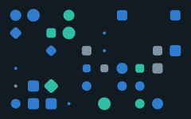 | 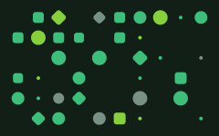 | 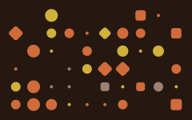 | 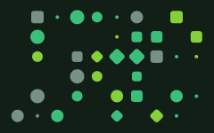 | 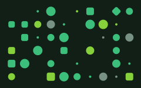 |

| fjord | geyser | harbor | iris | juniper |
| --- | --- | --- | --- | --- |
| 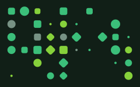 | 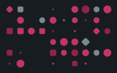 | 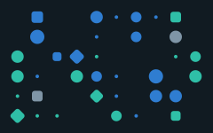 |  |  |

#### rings@1 — концентрические окружности, залитые или обводкой

| aurora | basalt | cinder | drift | ember |
| --- | --- | --- | --- | --- |
| 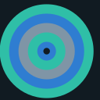 | 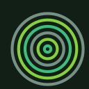 |  | 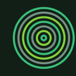 | 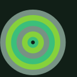 |

| fjord | geyser | harbor | iris | juniper |
| --- | --- | --- | --- | --- |
| 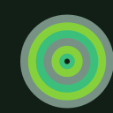 | 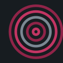 | 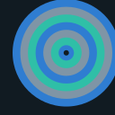 | 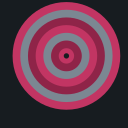 | 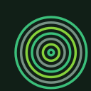 |

#### stripes@1 — диагональные полосы

| aurora | basalt | cinder | drift | ember |
| --- | --- | --- | --- | --- |
|  |  | 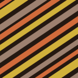 |  |  |

| fjord | geyser | harbor | iris | juniper |
| --- | --- | --- | --- | --- |
|  |  |  |  |  |

#### waves@1 — слоистые синусоиды

| aurora | basalt | cinder | drift | ember |
| --- | --- | --- | --- | --- |
| 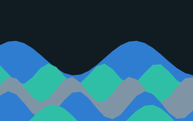 |  | 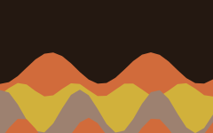 |  |  |

| fjord | geyser | harbor | iris | juniper |
| --- | --- | --- | --- | --- |
|  |  |  |  |  |

## Пакеты

| Пакет | Описание |
| --- | --- |
| [`packages/core`](../packages/core) | `constellation-preview`, библиотека |
| [`packages/cli`](../packages/cli) | `constellation-cli`, командный интерфейс |

## Установка

```bash
npm install constellation-preview
npm install -g constellation-cli
```

## Библиотека

```ts
import { generateSvg, generateDataUri, generateBatch, listStyles } from "constellation-preview";

generateSvg("identicon", "aurora");                           // SVG-строка, 320x320
generateSvg("cover", "aurora", { width: 1120, height: 700 });
generateDataUri("rings", "ember");
generateBatch("waves", ["aurora", "basalt", "cinder"]);
listStyles();
```

Опции: `width`, `height`, своя `palette` (`{ background, primary, secondary, neutral }`) или `paletteIndex`.

## CLI

```bash
constellation list
constellation generate identicon aurora -o avatar.svg
constellation generate rings ember --data-uri
constellation batch waves --seeds seeds.txt --out ./banners --width 240 --height 150
```

Файл сидов содержит один сид на строку. Строки, начинающиеся с `#`, и пустые строки пропускаются.

## Сторонние стили

Стиль — обычный объект: `name`, `version`, `label`, `description`, `size` и функция `render(context, options)`. Контекст содержит `seed`, `hash`, `random`, `palette`, `width` и `height`. `render` возвращает содержимое SVG; прямоугольник фона добавляет библиотека.

```ts
import { defineStyle, registerStyle } from "constellation-preview";

registerStyle(defineStyle({
  name: "orbits",
  version: 1,
  label: "Orbits",
  description: "Круги вокруг общего центра",
  size: { width: 320, height: 320 },
  render: ({ random, palette, width, height }) =>
    `<circle cx="${width / 2}" cy="${height / 2}" r="${40 + random() * 60}" fill="${palette.primary}"/>`
}));
```

Стили также можно грузить из директории флагом `--styles`. Каждый файл `*.js` или `*.mjs` описывает один стиль в default export:

```bash
constellation --styles ./my-styles list
constellation --styles ./my-styles generate orbits my-seed -o orbit.svg
```

## Детерминизм

- Один и тот же стиль, версия, сид и опции всегда дают один и тот же результат.
- PRNG инициализируется строкой `${name}@${version}:${seed}`. Палитра выбирается по хешу сида.
- Выпущенная версия стиля не меняется. Любое визуальное изменение получает новый номер версии.